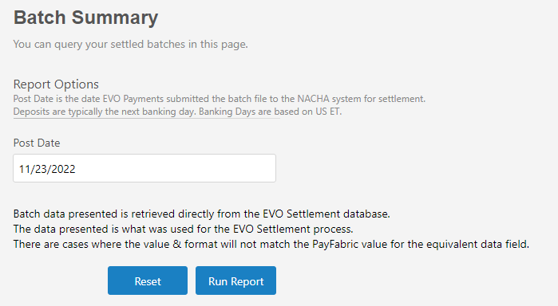
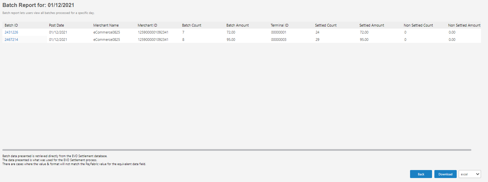
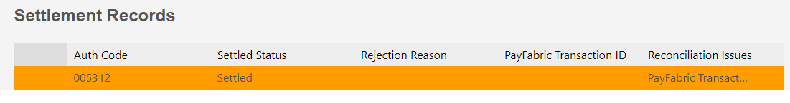
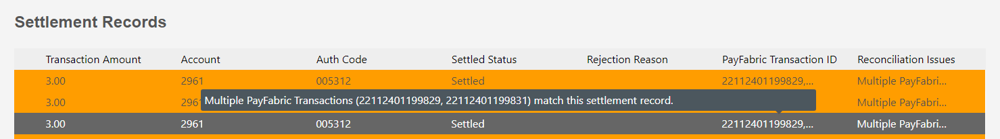

# Batch Summary Report
Batch Summary report supports PayFabric merchant users access settlement data to reconcile their PayFabric payments and meet the accounting needs. Batch Summary report can be downloaded as excel, csv and tsv.
Merchants can access Batch Summary report under Reports menu.

Click Run Report button to view Batch Summary report for specified Post Date .

# Batch Detail Records
Merchant can view Batch details report by clciking the Batch ID, Batch detail report lets users view all transactions processed within a batch and show reconciliation result, user can download the details report as well.

<b>Transaction does not exist in PayFabric will be highlighted in orange as below and will show message 'PayFabric Transaction could not be found.' in Reconciliation Issue column. <b>
  

<b>Multiple transactions found in PayFabric will be highlighted in orange as below and show message 'Multiple PayFabric Transactions match this settlement record.'<b>

  
<b>PayFabric also provide the ability to get Batch Summary report, Batch Details report and Export Batch details report via API, please refer [Settlement](https://github.com/PayFabric/APIs/blob/R20/PayFabric/Sections/Settlement.md#settlement) for details.</b>
  

