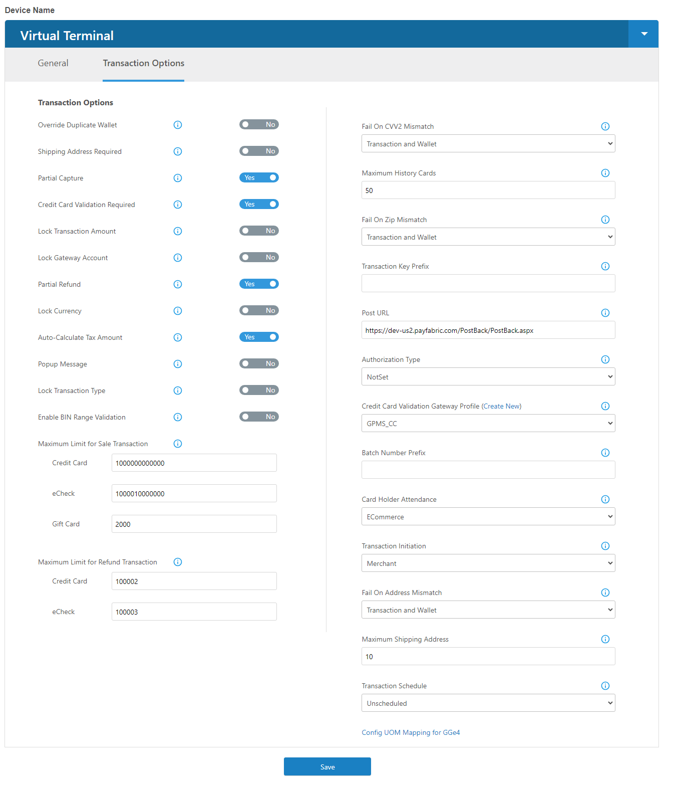
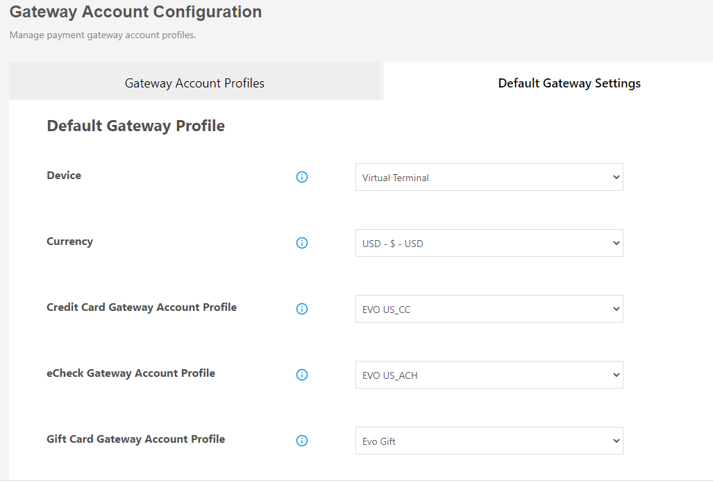

To configure transaction-related settings. Please see the detailed description for each corresponding section below. 

# PayFabric Settings

Navigate to Settings > DEV Central > PayFabric Settings.

## Design Mode

PayFabric Virtual Terminal has introduced two UI Modes for the virtual terminal, `Legacy Design` and `Modern Design`

* `Legacy Design`: Maintain the existing user interface and experience for the virtual terminal where the user can mimic the hosted API calls for PayFabric and also review the custom device theme directly on the PayFabric portal. 

* `Modern Design`: Introduce a new user-friendly design for Virtual Terminal to allow merchants to process transactions against the PayFabric web portal via web entry and/or terminal entry. 

## Device Name
The drop-down consists of all existing devices associated with the PayFabric account. PayFabric enable user to configure different transaction settings for every device. Choose the corresponding device from the drop-down list, then begin making changes to the settings.

## Form Settings
With `Modern Design` mode for Virtual Terminal, the defined field(s) that will be Hide/Optional/Required/Data Level Qualification on the `Process a Transaction` page by ticking or unticking the field name from the list, to control the additional values for transaction processing.
|Field                          |Description  | 
|:------------------------------|:-------------| 
| Hide                          | Upon selection, this option will hide this field for the user on modern VT.  |
| Optional                      | Upon selection, this option will show but is optional for the user on modern VT. |
| Required                      | Upon selection, this option will show and is required for the user on modern VT. |
| Data Level Qualification      | Upon selection, this option will dynamically display this field is only required to be populated if the card level is purchasing/corporate/business card.|

## Accept Card Types
Define the supported card type(s) by tick or untick the card type from the list. 

## Transaction Options
These are settings related to processing a payment transaction. 

|Field                          |Description  | 
|:------------------------------|:-------------| 
|Fail On Zip Mismatch| Choose **Transaction**, then PayFabric will automatically void any approved payment if the zip validation fails by the gateway/processor. This setting also applies to _Verify_ transactions. Choose **Wallet**, then PayFabric will not save the wallet if zip validation fails by the gateway/processor.  Choose **Transaction and Wallet**, and then the zip validation will be applied to both transaction processing and wallet creation.  Choose **Disable**, then disable the zip validation in PayFabric.  **Note**: If want to enable zip validation during wallet creation/updating, then must enable the Credit Card Validation Required option.|
| Lock Transaction Amount        | If this option is marked, the system will prevent the user from changing the transaction amount on PayFabric’s hosted payment page. |
| Lock Gateway Account           | If this option is marked, the system will prevent the user from changing the gateway account profile on PayFabric’s hosted payment page. |
| Fail On CVV2 Mismatch          | Choose **Transaction**, then PayFabric will automatically void any approved payment if the CVV2 validation fails by the gateway/processor. This setting also applies to _Verify_ transactions. Choose **Wallet**, then PayFabric will not save the wallet if CVV2 validation fails by the gateway/processor.  Choose **Transaction and Wallet**, and then the CVV2 validation will be applied to both transaction processing and wallet creation.  Choose **Disable**, then disable the CVV2 validation in PayFabric.  **Note**: If want to enable CVV2 validation during wallet creation/updating, then must enable the Credit Card Validation Required option. |
| Shipping Address Required | By default, a shipping address is not required for processing transactions. Checking this option to enable this logic. |
| Partial Capture | This option is for capturing a pre-authorized transaction. By default (uncheck), the capturing amount must be the same as pre-authorization. By checking this option, the merchant allows the capturing amount less/more than the original pre-authorization transaction.|
| Lock Transaction Type| If this option is marked, the system will prevent the user from changing the transaction type on PayFabric’s hosted payment page.|
|Fail On Address Mismatch |Choose **Transaction**, then PayFabric will automatically void any approved payment if the address validation fails by the gateway/processor. This setting also applies to _Verify_ transactions. Choose **Wallet**, then PayFabric will not save the wallet if address validation fails by the gateway/processor.  Choose **Transaction and Wallet**, and then the address validation will be applied to both transaction processing and wallet creation.  Choose **Disable**, then disable the address validation in PayFabric.  **Note**: If want to enable address validation during wallet creation/updating, then must enable the Credit Card Validation Required option.  |
|Lock Currency| If this option is marked, the system will prevent the user from changing the currency type on PayFabric’s hosted payment page.|
|Popup Message|If this option is check marked, the system will display a response or error message to the end-user using a popup message instead of inline within PayFabric’s hosted payment page and hosted wallet page.|
|IP Address Validation for Security Token|If enabled, PayFabric will validate the security token’s IP address. If the IP address associated with the security token at the time of token creation does not match the security token at the time of token consumption, PayFabric will return the ‘failed authentication’ error during API calls. If disabled, PayFabric will not validate the security’s token IP address during API calls. By default, this setting is enabled.|
|Partial Refund|If enabled, PayFabric will allow processing partially referenced credit/refund transactions for their customers from `Manage Transactions`. Note: This option is only available for Virtual Terminal. |
|Return Legacy Transaction Types |If enabled, when retrieving transactions through the use of the API, the transaction types returned will be those of the legacy Book, Ship, and Credit instead of the new Authorization, Capture, and Refund.|
|Credit Card Validation Required |If enabled, Payfabric will validate the credit card before storing it for later use.|
|Enable Bin Range Validation |If enabled, PayFabric will do BIN Range validation on all credit card data to determine the card type. If the card level is a Non-Commercial card, PayFabric will exclude L2/L3 data when submitting to gateway/processing.|
|Enabled For Fraud|If enabled, transactions processed with the current device will be submitted for fraud check.|
|Maximum Limit for Sale Transaction(Credit)|Specify a maximum amount for Sale/Authorization/Force transaction when processing a transaction with a credit card.|
|Maximum Limit for Sale Transaction(eCheck)|Specify a maximum amount for Sale transaction when processing a transaction with eCheck.|
|Maximum Limit for Refund Transaction(Credit)|Specify a maximum amount for a refund transaction when processing a transaction with a credit card.|
|Maximum Limit for Refund Transaction(eCheck)|Specify a maximum amount for refund transaction when processing transaction with eCheck.|
|Enable Tip Amount |If enabled, will show Tip - Option 1, Tip - Option 2, and Tip - Option 3 on the setting page; MRHPP will display three buttons according to the rates of these Tip options. With that, "No Tip" and "Other" buttons will be added as well, which allow users to select tip rate or enter tip amount. <b>Note:</b> This setting is only applicable for created devices rather than Virtual Terminal.|
|Tip - Option 1|This option will be available after Enable Tip Amount, it allows 2 decimal places.|
|Tip - Option 2|This option will be available after Enable Tip Amount, it allows 2 decimal places. The value must be greater than the value entered in Tip - Option 1.|
|Tip - Option 3|This option will be available after Enable Tip Amount, it allows 2 decimal places. The value must be greater than the value entered in Tip - Option 2.|
|Override Duplicate Wallet|If set to 'Yes', this will allow PayFabric to override existing duplicate wallet records with newly provided data. If set to 'No' (default), PayFabric will restrict saving duplicate wallet entries based on the combined dataset validation below: Credit Card: Customer #, Account#, Expiration Date; ACH: Customer #, Account #, Routing #|
|Auto-Calculate Tax Amount|If True, PayFabric will auto-calculate local sales tax amount for Level 2 data based on default or provided tax rate when: a.Level 2 Default is enabled AND b.Card Level is 'purchasing' or 'corporate' or 'business' card AND c.Tax Amount is 0.00, **Note:** If both the 'Tax Amount' field and 'Tax Rate' field has a value greater than 0.00 AND the 'Auto-Calculate Tax Amount’ field is set to True, then the field with the higher priority will be the ‘Tax Amount’ field. ; If False, PayFabric will behave the same way it is today, which will not auto-calculate tax amount based on specified tax rate when Level 2 Default is enabled. |

## General Settings
|Field                          |Description  | 
|:------------------------------|:-------------| 
| Transaction Key Prefix          | User-defined prefix for PayFabric transaction key. |
| PostURL       | PayFabric will post transaction response data (Non-sensitive fields) to this URL once this transaction is processed (successful or failed). **Note:** For 3DS transactions, you will get 2 webhooks. One that is the 3DS Challenge status and one that is the final transaction response. |
| Maximum History Cards |Limit the number of wallet entries loaded on PayFabric hosted pages by specifying the number of saved cards. The default value is 10.|
| Return URL|A URL address that PayFabric can redirect to once a transaction is processed. The response fields will be encoded and attached to the query string.|
| Maximum Shipping Address| Limit the number of shipping address(s) loaded on the PayFabric hosted payment page by specifying the number of saved cards. The default value is 10. Note: this option is only available for `Legacy Design`|
| Batch Number Prefix| User-defined prefix for batch number. Note: this option is only available for `Legacy Design`|
|Enable Security Token|For APIs and Hosted Pages: this is the default option where security tokens will be allowed to be used as the authentication method in both hosted pages and APIs. For Hosted Pages Only: With this option, a security token is only able to be used as the authentication method in hosted pages. The API service response will fail authentication if any API calls are authenticated using a security token.|
| Default Transaction Type|PayFabric offers the ability for merchants to specify the default transaction type on PayFabric’s Virtual Terminal. Note: this option is only available for `Modern Design`|
| Credit card validation gateway profile| This is a sub-setting for ``Credit Card Validation Required``, now support validating credit card from EVO, CybersourceSOAP, Paymentech, and Global Payments|
| Authorization Type | Default indicator if API or Hosted page does not send in Authorization Type's option. |
| Transaction Schedule | Default indicator if API or Hosted page does not send in Transaction Schedule's option. |
| Transaction Initiation | Default indicator if API or Hosted page does not send in Transaction Initiation's option.  |

## Unit Of Measure Mapping for Payeezy (First Data GGE4)
For merchants using the Payeezy gateway, the item’s unit of measure needs to be mapped to the values supported by the gateway. See the referenced URL for valid UOM from First Data. 

Reference: https://support.payeezy.com/hc/en-us/articles/203732159-Units-of-Measure

# Default Gateway Settings

Navigate to Settings > Gateway Account Configuration > Default Gateway Settings.

With the `Modern Design` mode for Virtual Terminal, PayFabric provides merchant the ability to specify a default gateway profile based on currency types so their internal user does not need to select a gateway profile at the time of processing a transaction. This functionality is supported through PayFabric API calls for all PayFabric apps/devices.

Each Device is allowed to set up a Credit card and an eCheck gateway profile against currency, prior to setting up the default gateway, the gateway profile must be created from `Settings` > `Gateway Account Profiles`. The `Virtual Terminal` option of Device Name is only available when Design Mode is `Modern Design` under `PayFabric Settings`.

# Discretionary Data

Navigate to Settings > Discretionary Data.

With the `Modern Design` mode for Virtual Terminal, the merchant will have the ability to create their own custom field to associate additional data for each transaction with PayFabric. Discretionary data will only reside with PayFabric and will not be passed on to the payment gateway or payment processor. 

# Products

Navigate to Settings > Products.

With the `Modern Design` mode for Virtual Terminal, PayFabric provides the ability to manage the products. The uploaded products can be added to the transactions when processing transactions.
